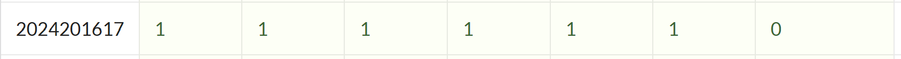

# bomblab 报告

姓名：赵梓名		学号：2024201617

| 总分 | phase_1 | phase_2 | phase_3 | phase_4 | phase_5 | phase_6 | secret_phase |
| --------- | ------------- | ------------- | ------------- | ----------------- |-----------|-----------|-----------|
| 7      | 1            | 1            | 1            | 1 |1  |1  |1  |


scoreboard 截图：




## 解题报告

### phase_1

```c
    1439:	48 8d 35 40 1d 00 00 	lea    0x1d40(%rip),%rsi
    1440:	e8 41 08 00 00       	call   1c86 <strings_not_equal>
    1445:	85 c0                	test   %eax,%eax
    1447:	75 05                	jne    144e <phase_1+0x19>
    144e:	e8 98 0a 00 00       	call   1eeb <explode_bomb>
```

​	为不跳转到 `144e` 行使得炸弹引爆，在 `1445` 行比较中，需输入的字符串与 `0x1d40(%rip)` 一致。访问该处：

```assembly
   0x0000555555555439 <+4>:     lea    0x1d40(%rip),%rsi        # 0x555555557180
(gdb) x/s 0x555555557180
0x555555557180: "But I am so still here surrender the silence..."
```

​	可见 `phase_2` 答案为：**But I am so still here surrender the silence...**

---


### phase_2

``` c
int matA[2][3] = {966, 649, 371, 194, 951, 493};
int matB[3][2] = {800, 617, 237, 278, 866, 223};	// 外部矩阵定义

void phase_2(char *input) {
    // 读取并检验
    int a, b, c, d;		int expected[4] = {a, b, c, d};
    if (sscanf(input, "%d %d %d %d", &a, &b, &c, &d) != 4)	explode_bomb();

    // 计算并验证结果
    int result_matrix[2][2] = matA \cdot matB
    if (result_flat[i] != expected[i])	explode_bomb();
}
```

​	程序实现了两个矩阵的乘法，要求我们正确输入结果。如何得知矩阵的初始值？注意到以下两行：

```assembly
   0x000055555555548e <+57>:    lea    0x4c9b(%rip),%rdi        # 0x55555555a130 <matA.2>
   0x00005555555554bb <+102>:   lea    0x4c4e(%rip),%rsi        # 0x55555555a110 <matB.1>
```

​	于是：

```assembly
(gdb) x/8wd 0x55555555a130
0x55555555a130 <matA.2>:        966     649     371     194
0x55555555a140 <matA.2+16>:     951     493     0       0
(gdb) x/8wd 0x55555555a110
0x55555555a110 <matB.1>:        800     617     237     278
0x55555555a120 <matB.1+16>:     866     223     0       0
```

​	通过计算，本题答案是：**1247899    859177    807525    494015**

---


### phase_3

```c
void phase_3(char *input) {
    // 读取并检验
    int a, b, result;
    if (sscanf(input, "%d %d", &a, &b) <= 1)	explode_bomb();
    if (b >= 0 || a > 7)	explode_bomb(); 

    // 计算并验证结果
    switch (a) {
        case 0: case 1: case 2: case 3: explode_bomb();	break;
        case 4: case 6: result = 0;	break;
        case 5: case 7: result = -542;	break;
        default: explode_bomb();
    }
    if (a > 5 || b != result)	explode_bomb();
}
```

​	解为：**5    -542** 。由于 `switch` 表，可行的 `a` 只能为 `4` 或 `5` ，由于 `b` 负数的限制，只有以上唯一解。

​	这道题 `jump` 语句较多，需灵活判断怎样的取值是安全的。

---


### phase_4

```c
int func4_1(int n) {	// n 在 %rdi 中
    if (n <= 0)	return 0;
    if (n == 1) return 1;
    return 2 * func4_1(n - 1) + 1;	// 以 %eax 返回
}
```

```c
void func4_2(int n, int ebx, char r12, char r13, char r14, char *output) {
    // 基础情况：第一步
    if (n == 1) {output[0] = r12;	output[1] = r13;	output[2] = '\0';	return;}

    int steps = func4_1(n - 1);  // 2^(n-1) - 1
    // 递归处理 n-1
    if (steps >= ebx) func4_2(n-1, ebx, r14, r13, r12, output);
    // 刚好第 ebx 步
    else if (steps + 1 == ebx) {output[0] = r12;	output[1] = r13;	output[2] = '\0';}
    // 跳过前 steps+1 步
    else {ebx = ebx - steps - 1;	func4_2(n-1, ebx, r13, r12, r14, output);}
}
```

```c
void phase2(char *input) {
    // 读取并检验
    int num;	char steps[3];	char expected[3];
    if (sscanf(input, "%d %s", &a, &b) != 2)	explode_bomb();
    if (a != func4_1(5) || strlen(b) != 2)		explode_bomb();
    
    // 计算并验证结果
    func4_2(5, 12, 'A', 'B', 'C', expected);
    if (strcmp(steps, expected) != 0)	explode_bomb();
}
```

​	简言之，`func4_1` 通过递归，计算 `n` 阶 `Hanoi Tower` 的最少步数；`func4_2` 同样使用递归，计算此时某一步的移动方法。而主函数负责检验两个输入参数，第一个必须是 `5` 阶 `Hanoi Tower` 的最少移动步数 `31` ，第二个是第 `12` 步的移动方法 `CB` ，这样才能避免爆炸。因此，答案为： **31    CB**

---


### phase_5

```c
void phase_5(char *input) {
    // 读取并检验
    int a, b;
    if (sscanf(input, "%d %d", &a, &b) <= 1)	explode_bomb();
    if (a >= 0)	explode_bomb();
    int index = a & 0xf;
    if (index == 0xf)	explode_bomb();
    
    // 计算并验证结果
    int sum = 0, count = 0, cur_value = 0, array[16] = [<array>];
    do {
        cur_value = array[index];
        sum += cur_value;	count++;
        index = (unsigned char)cur_value;
    } while (cur_value != 0xf);
    if (count != 7 || b != sum)	explode_bomb();
}
```

​	这题比较有趣，题目内编码了一个数列（更像链表），访问之：

```assembly
   0x0000555555555800 <+80>:    lea    0x1a39(%rip),%rsi        # 0x555555557240 <array.0>
(gdb) x/16d 0x555555557240
0x555555557240 <array.0>:       10      2       14      7
0x555555557250 <array.0+16>:    8       12      15      11
0x555555557260 <array.0+32>:    0       4       1       13
0x555555557270 <array.0+48>:    3       9       6       5
```

​	得到 `array[16] = [10, 2, ... , 5]` 。接下来我们需要找到一个参数 `index` ，使得：

- 从起点 `index` 开始，每次访问 `array[index]` 作为下一次访问的 `index` ；
- 连续访问 `7` 次，最终访问的 `array[index]` 为 `15` ；
- 全程所有 `index` 之和，应当等于输入的第二个参数 `b` .

​	倒推一下：（`index` 实际运行时，取模 `16` 的余）

```
起点：index = 8
│
├─→ array[8]  = 0   （值是0，下一个index = 0）
│
├─→ array[0]  = 10  （值是10，下一个index = 10）
│
├─→ array[10] = 1   （值是1，下一个index = 1）
│
├─→ array[1]  = 2   （值是2，下一个index = 2）
│
├─→ array[2]  = 14  （值是14，下一个index = 14）
│
├─→ array[14] = 6   （值是6，下一个index = 6）
│
├─→ array[6]  = 15  （值是15 = 0xf，**停止！**）
│
└─ 累加：0+10+1+2+14+6+15 = 48  ✅
   循环次数：7 次  ✅
```

​	可见一个可行答案为：**-8 48** （第一个参数应当为负数，且模 16 余 8 ）


---


### phase_6

```c
struct Node {
    int data;
    int node_number;
    struct Node *next;
};

node1.data ~ node6.data = (469, 265, 493, 980, 255, 827);

void phase_6(char *input) {
    // 读取并检验
    int nums[6];
    read_six_numbers(input, nums);
    for (int i = 0; i < 6; i++) {	// 输入应为正整数 1~6 的某个排序
        if ((unsigned)(nums[i] - 1) > 5)	explode_bomb();
        for (int j = i + 1; j < 6; j++) {if (nums[i] == nums[j])	explode_bomb();}
    }
    
    // 计算并验证结果   
    // 按输入找到对应 node ，并按顺序连接
    struct Node *nodes[6];
    for (int i = 0; i < 6; i++) {
        struct Node *cur = &node1;
        for (int j = 1; j < nums[i]; j++)	cur = cur->next;
        nodes[i] = cur;
    }
    for (int i = 0; i < 5; i++)	nodes[i]->next = nodes[i + 1];
    nodes[5]->next = NULL;
    
    // 需要 node 的 data 递增
    struct Node *cur = nodes[0];
    for (int i = 0; i < 5; i++) {	
        if (cur->data > cur->next->data)	explode_bomb();  // 如果逆序，explode_bomb()
        cur = cur->next;
    }
}
```

​	这里有若干个节点，需要我们按序重连，使得链表中 `node.data` 递增。其实就是排序，各个 `node` 如下：

| 节点          | node1   | node2   | node3   | node4   | node5   | node6   |
| :------------ | :------ | :------ | :------ | :------ | :------ | :------ |
| 地址          | 0x6210  | 0x6220  | 0x6230  | 0x6240  | 0x6250  | 0x6160  |
| data (十进制) | **469** | **265** | **493** | **980** | **255** | **827** |
| next 指向     | 0x6220  | 0x6230  | 0x6240  | 0x6250  | 0x6160  | 0x0000  |

​	观察得知，答案为：**5  2  1  3  6  4** 。按照这个顺序，`255->265->469->493->827->980` 升序，符合要求。


---


### serect_phase

​	隐藏谜题需要在 `phase 6` 中输入追加 `cipher` 触发，是一个骑士走迷宫问题：

```
棋盘：     
     列: 0  1  2  3  4  5  6  7
行 0:    H  .  #  .  .  #  .  .
行 1:    .  .  .  #  .  .  .  #
行 2:    #  .  #  .  .  #  .  .
行 3:    #  .  .  .  .  .  .  .
行 4:    .  #  .  .  #  .  #  ★  <- 目标 (4,7)
行 5:    #  .  .  #  #  .  .  .
行 6:    .  .  .  .  .  #  .  #
行 7:    .  .  .  .  .  .  .  .

图例: H -> 起点；. -> 可通行；# -> 障碍；★ -> 目标
```

```
移动规则：
     列: 1  2  3  4  5
行 1:    .  7  .  0  .
行 2:    6  .  .  .  1
行 3:    .  .  H  .  .
行 4:    5  .  .  .  2
行 5:    .  4  .  3  .

图例: M -> 当前位置(3,3)；数字0-7 -> 对应方向的移动目标位置
```

​	一种可行走法是 **33022** （也是本题答案），对应走法为：

```
      列: 0  1  2  3  4  5  6  7
行 0:    H  .  #  .  .  #  .  .
行 1:    .  .  .  #  .  .  .  #
行 2:    #  1  #  3  .  #  .  .
行 3:    #  .  .  .  .  4  .  .
行 4:    .  #  2  .  #  .  #  5  <- 目标★
行 5:    #  .  .  #  #  .  .  .
行 6:    .  .  .  .  .  #  .  #
行 7:    .  .  .  .  .  .  .  .
```


---


## 反馈/收获/感悟/总结

​	是谁做完了六个 phase 才想起来可以直接 `break explode_bomb` ？哦原来是我啊。

​	我的办法就是先 GDB 无赖调内存，要 `cmp` 跳转这种扭回来（但复杂代码就很难调了）。比较简单的话，先输入一些很大的值，看一下准备比较时的两项，看下有没有规律，比方说有时寄存器值就是某个位置的输入参数。

​	感悟是，还好现在不是只能用汇编写代码了。这玩意简直是巫术。
